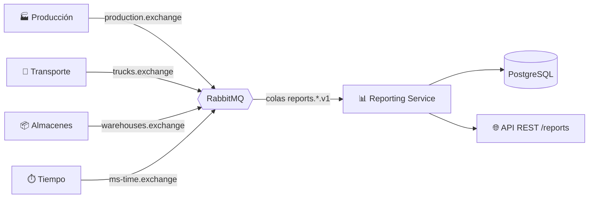

# 📊 Reporting Service · Supply Chain Simulator

> Microservicio que escucha todo lo que pasa en una cadena de suministro simulada (fábricas, almacenes, camiones y tiempo) y lo convierte en un **registro de eventos consultable** y en **estadísticas en tiempo real**.


---

## 📌 Contexto del proyecto

Este repositorio contiene **mi parte** de un proyecto en equipo: un simulador de cadena de suministro desarrollado con microservicios por un grupo de unas 20 personas durante mis prácticas en **GFT Technologies**. El simulador recorre el ciclo completo de un pedido, desde que se crea hasta que llega al cliente.

Cada equipo se encargó de un servicio. El mío es el **servicio de reporting**, que no genera datos propios: observa a los demás servicios y los resume.

🔗 **Proyecto completo del equipo:** [supply-chain-simulator-workshop](https://github.com/PauLopNun/supply-chain-simulator-workshop)

---

## 🧩 Qué hace

- **Consume eventos** de cuatro servicios a través de RabbitMQ: producción (fábricas), transporte (camiones), almacenes y tiempo de simulación.
- **Los guarda** en PostgreSQL como un *event log* (patrón de registro de eventos), con su tipo, servicio de origen, contenido y día de simulación.
- **Los expone** mediante una API REST con paginación.
- **Calcula estadísticas globales**: pedidos creados, completados, bloqueados y camiones en tránsito.
- **Mantiene un historial de pedidos** con el último estado de cada uno.

---

## 🏗️ Arquitectura



El código está organizado en capas, separando la lógica de negocio de los detalles técnicos:

```
eventlog/
├── domain/           → entidades, tipos de evento y excepciones de dominio
├── application/      → servicios y proyecciones (estadísticas, historial)
└── infrastructure/   → controlador REST, persistencia JPA y consumidores RabbitMQ
rabbitmq/             → configuración de exchanges, colas y bindings
shared/               → manejo común de errores de la API
```

---

## 🔌 API

| Método | Endpoint | Descripción |
|--------|----------|-------------|
| `GET` | `/reports?page=0&size=20` | Registro de eventos paginado |
| `GET` | `/reports/{id}` | Detalle de un evento por su UUID |
| `GET` | `/reports/stats` | Pedidos totales, completados, bloqueados y camiones en tránsito |
| `GET` | `/reports/orders/history?page=0&size=50` | Último estado de cada pedido |
| `GET` | `/actuator/health` | Estado del servicio |

La documentación interactiva (OpenAPI) está disponible en `/swagger-ui/index.html`.

**Ejemplo de respuesta de `/reports/stats`:**

```json
{
  "totalOrders": 150,
  "completedOrders": 85,
  "blockedOrders": 3,
  "trucksInTransit": 12
}
```

Los errores devuelven una respuesta estructurada: `404` si el evento no existe y `400` si el identificador no es un UUID válido.

---

## 📨 Eventos que procesa

| Origen | Eventos |
|--------|---------|
| 🏭 **Producción** | Pedido creado, iniciado, bloqueado y completado · registro de recetas y fábricas |
| 🚚 **Transporte** | Camión registrado, eliminado, cambio de estado y actualización de posición · entrega creada y completada |
| 📦 **Almacenes** | Almacén registrado · cambio de stock · reposición solicitada · pedido bloqueado |
| ⏱️ **Tiempo** | Avance del día de simulación |

Cada tipo de evento tiene su propia cola duradera (`reports.<evento>.v1`), con reintentos automáticos (3 intentos) y excepciones específicas de serialización y procesamiento.

---

## 🛠️ Tecnologías

| Área | Herramientas |
|------|--------------|
| Lenguaje y framework | Java 21, Spring Boot 3.5, Spring Web, Spring Validation |
| Mensajería | RabbitMQ (Spring AMQP) |
| Datos | PostgreSQL, Spring Data JPA, Liquibase (migraciones) |
| Documentación | springdoc OpenAPI / Swagger UI |
| Observabilidad | Spring Boot Actuator, indicador de salud de RabbitMQ |
| Testing | JUnit 5, Mockito, Testcontainers, Awaitility, H2 |
| Calidad | JaCoCo (cobertura), Spotless con google-java-format |
| DevOps | Docker multi-stage, Docker Compose, GitHub Actions, AWS ECR + ECS |

---

## 🚀 Cómo ejecutarlo en local

**Requisitos:** Java 21, Docker y Docker Compose.

```bash
# 1. Levantar PostgreSQL y RabbitMQ
docker compose up -d

# 2. Arrancar el servicio
./mvnw spring-boot:run
```

- API: <http://localhost:8081/reports>
- Swagger UI: <http://localhost:8081/swagger-ui/index.html>
- Panel de RabbitMQ: <http://localhost:15672> (usuario y contraseña por defecto de desarrollo: `guest` / `guest`)

Las migraciones de la base de datos se aplican solas al arrancar gracias a Liquibase.

### Configuración

La conexión a RabbitMQ se configura con variables de entorno:

| Variable | Valor por defecto |
|----------|-------------------|
| `RABBITMQ_HOST` | `localhost` |
| `RABBITMQ_PORT` | `5672` |
| `RABBITMQ_USERNAME` | `guest` |
| `RABBITMQ_PASSWORD` | `guest` |
| `RABBITMQ_VHOST` | `/` |
| `RABBITMQ_SSL_ENABLED` | `false` |

> ⚠️ Los valores por defecto son **solo para desarrollo local**. En cualquier otro entorno deben sobrescribirse (por ejemplo, con variables de entorno de Spring como `SPRING_DATASOURCE_URL`) y nunca guardarse credenciales reales en el repositorio.

### Con Docker

```bash
docker build -t reporting-service .
```

La imagen se construye en dos fases (compilación y ejecución) y el contenedor corre con un **usuario sin privilegios**, no como root.

---

## ✅ Tests y calidad

```bash
./mvnw verify
```

El proyecto cuenta con **34 clases de test** que cubren dominio, servicios, controlador, mensajes y consumidores de eventos, incluyendo tests de integración con contenedores reales (Testcontainers), por lo que **hace falta Docker** para ejecutarlos.

El formato del código se comprueba con Spotless (google-java-format) y la cobertura se mide con JaCoCo.

---

## 🔄 CI/CD

- **Naming conventions:** un workflow valida que las ramas sigan el patrón `reporting/<tipo>/<descripcion>` y que los commits sigan `[reporting] tipo(ámbito): mensaje`.
- **Despliegue:** cada push a `master` construye la imagen, la sube a **Amazon ECR** y actualiza el servicio en **Amazon ECS**, autenticándose con **OIDC** (sin claves de acceso guardadas en el repositorio).

---

## 👤 Mi contribución

> ✏️ **Rellena esta sección con lo que hiciste tú.** Es la parte que más van a leer. Ejemplos del tipo de cosas que puedes contar (borra lo que no sea verdad):

- [Qué consumidores de eventos desarrollé: producción, transporte, almacenes, tiempo...]
- [Qué endpoints de la API implementé]
- [Qué tests escribí]
- [Qué retos tuve y cómo los resolví]

## 🎓 Qué aprendí

- [Comunicación asíncrona entre microservicios con RabbitMQ]
- [Trabajo en equipo con Git, ramas y convenciones de commits]
- [Testing con Testcontainers]

---

## 🤝 Créditos

Proyecto realizado en equipo durante las prácticas en GFT Technologies. Este repositorio recoge únicamente el servicio de reporting; el resto de servicios pertenecen a sus respectivos autores y están en el [repositorio del equipo](https://github.com/PauLopNun/supply-chain-simulator-workshop).

**Autor de este servicio:** Javier Mantoan · [LinkedIn](https://www.linkedin.com/in/javier-mantoan-dominguez)
